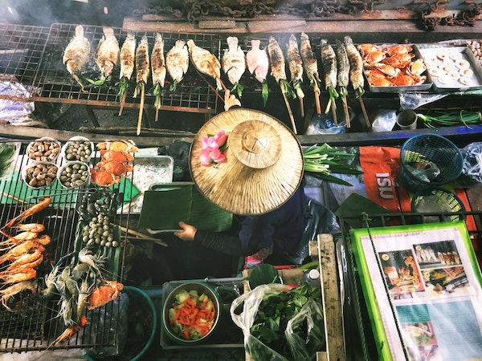

# 분류 시작하기

## 지역 주제: 맛있는 아시아 및 인도 요리🍜

아시아와 인도의 음식 전통은 매우 다양하고 맛있습니다! 지역 음식의 재료를 이해하기 위해 지역 요리에 대한 데이터를 살펴 보겠습니다.

> Photo by <a href="https://unsplash.com/@changlisheng?utm_source=unsplash&utm_medium=referral&utm_content=creditCopyText">Lisheng Chang</a> on <a href="https://unsplash.com/s/photos/asian-food?utm_source=unsplash&utm_medium=referral&utm_content=creditCopyText">Unsplash</a>
  
## 무엇을 배울 것인가

이 섹션에서는 회귀에 대한 이전 연구를 기반으로 하고 데이터를 더 잘 이해하는 데 사용할 수 있는 다른 분류자에 대해 배웁니다.

> 분류 모델 작업에 대해 배우는 데 도움이 되는 유용한 로우 코드 도구가 있습니다. Try [Azure ML for this task](https://docs.microsoft.com/learn/modules/create-classification-model-azure-machine-learning-designer/?WT.mc_id=academic-15963-cxa)

## Lessons

1. [Introduction to classification](2022-05-07-se1.md)
2. [More classifiers](2022-05-07-se2.md)
3. [Yet other classifiers](2022-05-07-se3.md)
4. [Applied ML: build a web app](2022-05-07-se4.md)

## Credits
 
"Getting started with classification" 은 이두사람에 의해 쓰여졌다 ♥️ by [Cassie Breviu](https://www.twitter.com/cassiebreviu) and [Jen Looper](https://www.twitter.com/jenlooper)

맛있는 요리 데이터세트의 출처는 [Kaggle](https://www.kaggle.com/hoandan/asian-and-indian-cuisines).
