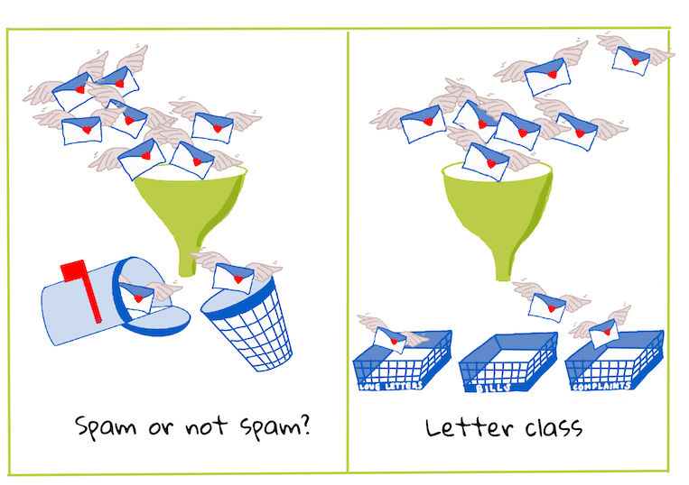
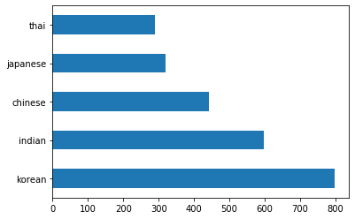
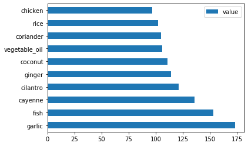
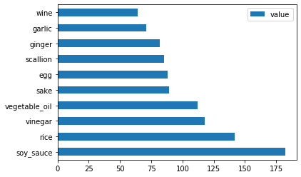
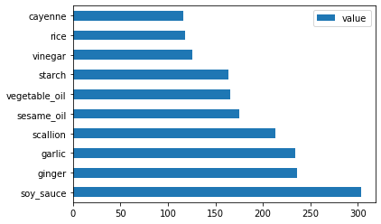
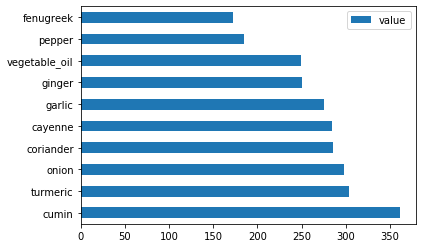
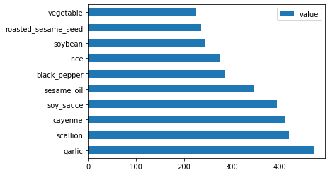

# 분류 소개

이 4개의 강의에서는 클래식 머신 러닝의 기본 초점인 _분류_를 탐구할 것입니다. 우리는 아시아와 인도의 모든 훌륭한 요리에 대한 데이터 세트와 함께 다양한 분류 알고리즘을 사용하여 안내할 것입니다. 당신이 배고픈 희망!


> 이 수업에서 범아시아 요리를 즐겨보세요!Image by [Jen Looper](https://twitter.com/jenlooper)

분류는 다음과 같은 형식입니다. [supervised learning](https://wikipedia.org/wiki/Supervised_learning) 회귀 기술과 많은 공통점이 있습니다. 머신 러닝이 데이터 세트를 사용하여 사물에 대한 값이나 이름을 예측하는 것이라면 일반적으로 분류는 _이진 분류_ 및 _다중 클래스 분류_의 두 그룹으로 나뉩니다.

[](https://youtu.be/eg8DJYwdMyg "Introduction to classification")

> 🎥 비디오를 보려면 위의 이미지를 클릭하십시오: MIT의 John Guttag가 분류를 소개합니다.

기억하다:

- **선형 회귀**는 변수 간의 관계를 예측하고 해당 선과의 관계에서 새 데이터 포인트가 속하는 위치에 대한 정확한 예측을 하는 데 도움이 되었습니다. 예를 들어 9월과 12월의 호박 가격은 얼마인지 예측할 수 있습니다.
- **로지스틱 회귀**는 "이진 카테고리"를 찾는 데 도움이 되었습니다. 이 가격대에서 _이 호박은 주황색입니까 아니면 주황색이 아닙니다_?


분류는 다양한 알고리즘을 사용하여 데이터 포인트의 레이블 또는 클래스를 결정하는 다른 방법을 결정합니다. 이 요리 데이터를 사용하여 재료 그룹을 관찰하여 원산지 요리를 결정할 수 있는지 알아보겠습니다.

## [Pre-lecture quiz](https://white-water-09ec41f0f.azurestaticapps.net/quiz/19/)

> ### [This lesson is available in R!](./solution/R/lesson_10-R.ipynb)

### 소개

분류는 기계 학습 연구원 및 데이터 과학자의 기본 활동 중 하나입니다. 이진 값의 기본 분류("이 이메일은 스팸입니까?")에서 컴퓨터 비전을 사용한 복잡한 이미지 분류 및 세분화에 이르기까지 데이터를 클래스로 분류하고 질문할 수 있는 것은 항상 유용합니다.

보다 과학적인 방식으로 프로세스를 설명하기 위해 분류 방법은 입력 변수 간의 관계를 출력 변수에 매핑할 수 있는 예측 모델을 생성합니다.



> 처리할 분류 알고리즘에 대한 이진 대 다중 클래스 문제. Infographic by [Jen Looper](https://twitter.com/jenlooper)


데이터 정리, 시각화 및 ML 작업을 위한 준비 프로세스를 시작하기 전에 머신 러닝을 활용하여 데이터를 분류할 수 있는 다양한 방법에 대해 알아보겠습니다.

[statistics](https://wikipedia.org/wiki/Statistical_classification), 기존 기계 학습을 사용한 분류는 '흡연자', '체중', '나이'와 같은 특성을 사용하여 _X병 발병 가능성_을 결정합니다. 이전에 수행한 회귀 연습과 유사한 지도 학습 기술로 데이터에 레이블이 지정되고 ML 알고리즘은 해당 레이블을 사용하여 데이터 세트의 클래스(또는 '특성')를 분류 및 예측하고 그룹 또는 결과에 할당합니다.

✅ 잠시 시간을 내어 요리에 대한 데이터 세트를 상상해 보십시오. 다중 클래스 모델은 무엇에 답할 수 있습니까? 이진 모델은 무엇에 답할 수 있습니까? 특정 요리에 호로파를 사용할 가능성이 있는지 확인하려면 어떻게 해야 합니까? 스타 아니스, 아티초크, 콜리플라워, 와사비로 가득 찬 식료품 가방을 선물로 주어 전형적인 인도 요리를 만들 수 있는지 알고 싶다면?

[](https://youtu.be/GuTeDbaNoEU "Crazy mystery baskets")

> 🎥 동영상을 보려면 위의 이미지를 클릭하세요. 쇼 '촙'의 전제는 셰프가 무작위로 선택한 재료로 요리를 만들어야 하는 '미스터리 바구니'입니다. 확실히 ML 모델이 도움이 되었을 것입니다!

## 분류자


이 요리 데이터 세트에 대해 묻고 싶은 질문은 실제로 **다중 클래스 질문**입니다. 작업할 수 있는 잠재적 국가 요리가 여러 개 있기 때문입니다. 재료 배치가 주어지면 이 많은 클래스 중 데이터가 맞는 것은 무엇입니까?


Scikit-learn은 해결하려는 문제의 종류에 따라 데이터를 분류하는 데 사용할 여러 알고리즘을 제공합니다. 다음 두 강의에서는 이러한 알고리즘 중 몇 가지에 대해 배웁니다.

## 데이터 정리 및 균형 조정

이 프로젝트를 시작하기 전에 가장 먼저 해야 할 일은 데이터를 정리하고 **균형을 조정**하여 더 나은 결과를 얻는 것입니다. 이 폴더의 루트에 있는 빈 _notebook.ipynb_ 파일로 시작합니다.


가장 먼저 설치해야 할 것은 [imblearn](https://imbalanced-learn.org/stable/). 이것은 데이터의 균형을 더 잘 맞출 수 있게 해주는 Scikit-learn 패키지입니다(이 작업에 대한 자세한 내용은 1분 내로 배우게 됩니다).

1. `imblearn`을 설치하려면 다음과 같이 `pip install`을 실행합니다.

    ```python
    pip install imblearn
    ```

2. 데이터를 가져오고 시각화하는 데 필요한 패키지를 가져오고 `imblearn`에서 `SMOTE`도 가져옵니다.

    ```python
    import pandas as pd
    import matplotlib.pyplot as plt
    import matplotlib as mpl
    import numpy as np
    from imblearn.over_sampling import SMOTE
    ```

이제 다음에 데이터 가져오기를 읽도록 설정되었습니다.

3. 다음 작업은 데이터를 가져오는 것입니다

    ```python
    df  = pd.read_csv('../data/cuisines.csv')
    ```


`read_csv()`를 사용하면 csv 파일 _cusines.csv_의 내용을 읽고 변수 `df`에 배치합니다.

4. 데이터의 모양을 확인하십시오.

    ```python
    df.head()
    ```

   
처음 5개 행은 다음과 같습니다.

    ```output
    |     | Unnamed: 0 | cuisine | almond | angelica | anise | anise_seed | apple | apple_brandy | apricot | armagnac | ... | whiskey | white_bread | white_wine | whole_grain_wheat_flour | wine | wood | yam | yeast | yogurt | zucchini |
    | --- | ---------- | ------- | ------ | -------- | ----- | ---------- | ----- | ------------ | ------- | -------- | --- | ------- | ----------- | ---------- | ----------------------- | ---- | ---- | --- | ----- | ------ | -------- |
    | 0   | 65         | indian  | 0      | 0        | 0     | 0          | 0     | 0            | 0       | 0        | ... | 0       | 0           | 0          | 0                       | 0    | 0    | 0   | 0     | 0      | 0        |
    | 1   | 66         | indian  | 1      | 0        | 0     | 0          | 0     | 0            | 0       | 0        | ... | 0       | 0           | 0          | 0                       | 0    | 0    | 0   | 0     | 0      | 0        |
    | 2   | 67         | indian  | 0      | 0        | 0     | 0          | 0     | 0            | 0       | 0        | ... | 0       | 0           | 0          | 0                       | 0    | 0    | 0   | 0     | 0      | 0        |
    | 3   | 68         | indian  | 0      | 0        | 0     | 0          | 0     | 0            | 0       | 0        | ... | 0       | 0           | 0          | 0                       | 0    | 0    | 0   | 0     | 0      | 0        |
    | 4   | 69         | indian  | 0      | 0        | 0     | 0          | 0     | 0            | 0       | 0        | ... | 0       | 0           | 0          | 0                       | 0    | 0    | 0   | 0     | 1      | 0        |
    ```


5. `info()`를 호출하여 이 데이터에 대한 정보를 가져옵니다.

    ```python
    df.info()
    ```

   당신의 아웃은 다음과 같습니다:

    ```output
    <class 'pandas.core.frame.DataFrame'>
    RangeIndex: 2448 entries, 0 to 2447
    Columns: 385 entries, Unnamed: 0 to zucchini
    dtypes: int64(384), object(1)
    memory usage: 7.2+ MB
    ```

## 요리에 대해 배우기

이제 작업이 더 흥미로워지기 시작합니다. 요리별 데이터 분포를 알아보자


1. `barh()`를 호출하여 데이터를 막대로 플로팅합니다.

    ```python
    df.cuisine.value_counts().plot.barh()
    ```

    

요리의 수는 유한하지만 데이터 분포가 고르지 않습니다. 당신은 그것을 고칠 수 있습니다! 그렇게 하기 전에 조금 더 탐색하십시오.


2. 요리별로 사용할 수 있는 데이터의 양을 확인하고 인쇄합니다.

    ```python
    thai_df = df[(df.cuisine == "thai")]
    japanese_df = df[(df.cuisine == "japanese")]
    chinese_df = df[(df.cuisine == "chinese")]
    indian_df = df[(df.cuisine == "indian")]
    korean_df = df[(df.cuisine == "korean")]
    
    print(f'thai df: {thai_df.shape}')
    print(f'japanese df: {japanese_df.shape}')
    print(f'chinese df: {chinese_df.shape}')
    print(f'indian df: {indian_df.shape}')
    print(f'korean df: {korean_df.shape}')
    ```

   출력은 다음과 같습니다.

    ```output
    thai df: (289, 385)
    japanese df: (320, 385)
    chinese df: (442, 385)
    indian df: (598, 385)
    korean df: (799, 385)
    ```

## 성분 발견


이제 데이터를 더 자세히 살펴보고 요리별 일반적인 재료가 무엇인지 알아볼 수 있습니다. 요리 간에 혼동을 일으키는 반복되는 데이터를 정리해야 하므로 이 문제에 대해 알아보겠습니다.


1. Python에서 'create_ingredient()' 함수를 생성하여 성분 데이터 프레임을 생성합니다. 이 기능은 도움이 되지 않는 열을 삭제하여 시작하고 개수를 기준으로 재료를 정렬합니다.

    ```python
    def create_ingredient_df(df):
        ingredient_df = df.T.drop(['cuisine','Unnamed: 0']).sum(axis=1).to_frame('value')
        ingredient_df = ingredient_df[(ingredient_df.T != 0).any()]
        ingredient_df = ingredient_df.sort_values(by='value', ascending=False,
        inplace=False)
        return ingredient_df
    ```

   
이제 해당 기능을 사용하여 요리별로 가장 인기 있는 상위 10개 재료에 대한 아이디어를 얻을 수 있습니다.

2. `create_ingredient()`를 호출하고 `barh()`를 호출하여 플롯합니다.

    ```python
    thai_ingredient_df = create_ingredient_df(thai_df)
    thai_ingredient_df.head(10).plot.barh()
    ```

    

3. 일본 데이터에 대해서도 동일한 작업을 수행합니다.

    ```python
    japanese_ingredient_df = create_ingredient_df(japanese_df)
    japanese_ingredient_df.head(10).plot.barh()
    ```

    


4. 이제 중국 재료:

    ```python
    chinese_ingredient_df = create_ingredient_df(chinese_df)
    chinese_ingredient_df.head(10).plot.barh()
    ```

    


5. 인도 재료를 플로팅합니다.

    ```python
    indian_ingredient_df = create_ingredient_df(indian_df)
    indian_ingredient_df.head(10).plot.barh()
    ```

    

6. 마지막으로 한국 재료를 플롯합니다.

    ```python
    korean_ingredient_df = create_ingredient_df(korean_df)
    korean_ingredient_df.head(10).plot.barh()
    ```

    


7. 이제 `drop()`을 호출하여 고유한 요리 간에 혼동을 일으키는 가장 일반적인 재료를 삭제합니다.

  
쌀, 마늘, 생강은 누구나 좋아합니다!

    ```python
    feature_df= df.drop(['cuisine','Unnamed: 0','rice','garlic','ginger'], axis=1)
    labels_df = df.cuisine #.unique()
    feature_df.head()
    ```

## 데이터세트 균형 조정


이제 데이터를 정리했으므로, 사용 [SMOTE](https://imbalanced-learn.org/dev/references/generated/imblearn.over_sampling.SMOTE.html) - "Synthetic Minority Over-sampling Technique" - 균형을 유지합니다.

1. `fit_resample()`을 호출합니다. 이 전략은 보간법으로 새 ​​샘플을 생성합니다.

    ```python
    oversample = SMOTE()
    transformed_feature_df, transformed_label_df = oversample.fit_resample(feature_df, labels_df)
    ```

데이터의 균형을 맞추면 분류할 때 더 나은 결과를 얻을 수 있습니다. 이진 분류에 대해 생각해 보십시오. 대부분의 데이터가 하나의 클래스인 경우 ML 모델은 해당 클래스에 대한 데이터가 더 많기 때문에 해당 클래스를 더 자주 예측합니다. 데이터 균형을 맞추면 왜곡된 데이터를 가져와 이러한 불균형을 제거하는 데 도움이 됩니다.

2. 이제 성분별 라벨 수를 확인할 수 있습니다.

    ```python
    print(f'new label count: {transformed_label_df.value_counts()}')
    print(f'old label count: {df.cuisine.value_counts()}')
    ```

출력은 다음과 같습니다.

    ```output
    new label count: korean      799
    chinese     799
    indian      799
    japanese    799
    thai        799
    Name: cuisine, dtype: int64
    old label count: korean      799
    indian      598
    chinese     442
    japanese    320
    thai        289
    Name: cuisine, dtype: int64
    ```

    The data is nice and clean, balanced, and very delicious! 
3. 마지막 단계는 레이블 및 기능을 포함하여 균형 잡힌 데이터를 파일로 내보낼 수 있는 새 데이터 프레임에 저장하는 것입니다.

    ```python
    transformed_df = pd.concat([transformed_label_df,transformed_feature_df],axis=1, join='outer')
    ```


4. `transformed_df.head()` 및 `transformed_df.info()`를 사용하여 데이터를 한 번 더 볼 수 있습니다. 다음 수업에서 사용할 수 있도록 이 데이터의 복사본을 저장합니다.

    ```python
    transformed_df.head()
    transformed_df.info()
    transformed_df.to_csv("../data/cleaned_cuisines.csv")
    ```

    This fresh CSV can now be found in the root data folder.

---

## 🚀도전

이 커리큘럼에는 몇 가지 흥미로운 데이터 세트가 포함되어 있습니다. `data` 폴더를 살펴보고 바이너리 또는 다중 클래스 분류에 적합한 데이터 세트가 포함되어 있는지 확인하십시오. 이 데이터세트에 대해 어떤 질문을 하시겠습니까?

## [Post-lecture quiz](https://white-water-09ec41f0f.azurestaticapps.net/quiz/20/)

## 복습 및 독학

SMOTE의 API를 살펴보세요. 어떤 사용 사례에 가장 잘 사용됩니까? 어떤 문제를 해결합니까?

## Assignment 

[Explore classification methods](assignment.md)
